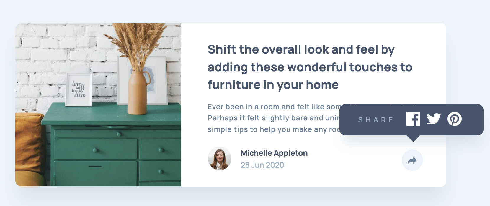

# Frontend Mentor - Article preview component solution

This is a solution to the [Article preview component challenge on Frontend Mentor](https://www.frontendmentor.io/challenges/article-preview-component-dYBN_pYFT). Frontend Mentor challenges help you improve your coding skills by building realistic projects. 

## Table of contents

- [Overview](#overview)
  - [The challenge](#the-challenge)
  - [Screenshot](#screenshot)
  - [Links](#links)
- [My process](#my-process)
  - [Built with](#built-with)
  - [What I learned](#what-i-learned)
  - [Continued development](#continued-development)
  - [Useful resources](#useful-resources)


## Overview

### The challenge

Users should be able to:
- View the optimal layout for the component depending on their device's screen size
- See the social media share links when they click the share icon

### Screenshot



### Links
- Live Site URL: [Add live site URL here](https://your-live-site-url.com)


## My process

### Built with
- Semantic HTML5 markup
- CSS custom properties
- Flexbox
- Mobile-first workflow


### What I learned

### 1."::after (:after) pseudo-element" 
```css
.wrapper__bottom__links::after {
    content: "";
    position: absolute;
    bottom: -0.8rem;
    left: 48%;
    width: 1.6rem;
    height: 1.6rem;
    transform: rotate(45deg);
    background-color: var(--v-gray-blue);
}
```


### Continued development

### 1.Positioning
- Become more familiar to the concept of position: relative; and position: absolute; as well as positioning properties.
### 2.Mobile-first workflow
- It was my first try to solve a challenge with mobile-first workflow. The creation of components felt smoother than working initially on desktop design.


### Useful resources
- [MDN Web Docs - "::after"](https://developer.mozilla.org/en-US/docs/Web/CSS/::after) - This helped me for adding a triangle below the popup text conponent using ::after pseudo-element.
